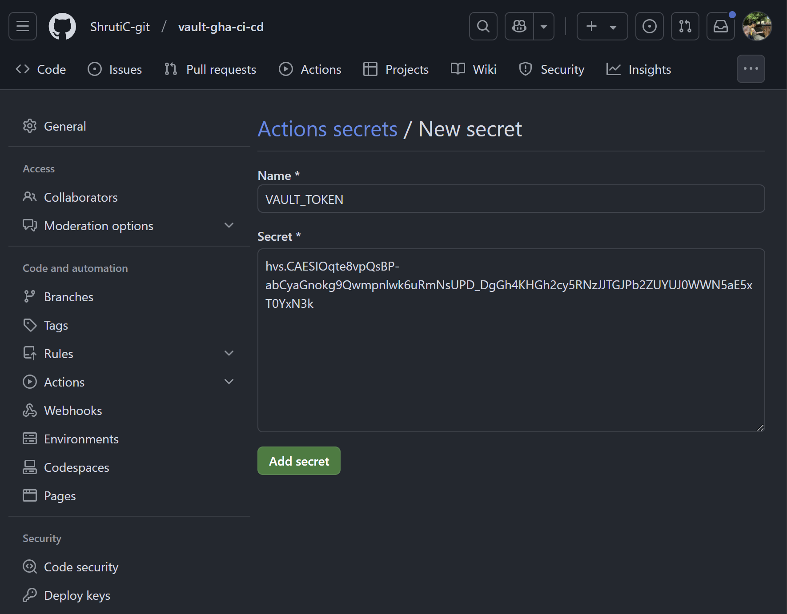

# Build a Secure CI/CD Pipeline for Kubernetes Using GitHub Actions and Hashicorp Vault

In this tutorial, you will learn how to use Hashicorp's [Vault](https://www.hashicorp.com/products/vault) to build CI/CD pipelines in [GitHub Actions](https://github.com/features/actions) to securely build, push, and deploy Docker images to Kubernetes.&#x20;

You will see how Vault can be used to securely store pipeline secrets like access tokens, API keys, etc. You will then configure a CI/CD pipeline using GitHub Actions to access these secrets stored in Vault and deploy the changes to a Kubernetes cluster. The [Vault GitHub action](https://github.com/marketplace/actions/hashicorp-vault) gives the ability to pull secrets from Vault in GitHub Action workflows. This tutorial uses [Helm](https://helm.sh/) to manage the Kubernetes application.

## Objectives:

In this tutorial, you will go through the following steps:



### [Store secrets on Vault](build-a-secure-ci-cd-pipeline-for-kubernetes-using-github-actions-and-hashicorp-vault.md#store-secrets-on-vault-1)

Store sensitive pipeline secrets on Vault.



### [Authenticate GitHub to access Vault](build-a-secure-ci-cd-pipeline-for-kubernetes-using-github-actions-and-hashicorp-vault.md#authenticate-github-to-access-vault-1)

Create Vault token and Vault policy used by GitHub Actions to authenticate to Vault.



### [Configure GitHub Actions](build-a-secure-ci-cd-pipeline-for-kubernetes-using-github-actions-and-hashicorp-vault.md#configure-github-actions-1)

Configure GitHub Actions to use secrets stored in Vault and orchestrate K8s deployments.



### [Test the CI/CD pipeline](build-a-secure-ci-cd-pipeline-for-kubernetes-using-github-actions-and-hashicorp-vault.md#test-the-ci-cd-pipeline-1)

Once GitHub Action workflow is configured, trigger the Action and test if the Action works as desired.



### [Troubleshooting](build-a-secure-ci-cd-pipeline-for-kubernetes-using-github-actions-and-hashicorp-vault.md#troubleshooting-1)

Troubleshoot common issues and errors encountered while using Vault and GitHub Actions.



## Prerequisites

Before starting this tutorial, you will need:&#x20;

* [ ] A Kubernetes cluster.

<details>

<summary><strong><code>Need a new cluster?</code></strong></summary>

Try our guide \<link> to running confidential K8s cluster using enclaive Dynemees.

</details>

* [ ] [kubectl](https://kubernetes.io/docs/reference/kubectl/) - installed locally and configured to point to your K8s cluster.
* [ ] A Vault environment with Vault CLI - [self-hosted](https://developer.hashicorp.com/vault/install) or [HCP Vault Dedicated](https://developer.hashicorp.com/vault/tutorials/get-started-hcp-vault-dedicated/create-cluster?productSlug=vault\&tutorialSlug=cloud\&tutorialSlug=get-started-vault).
* [ ] [jq](https://jqlang.org/) CLI for processing JSON
* [ ] [git CLI](https://git-scm.com/downloads) - installed and configured.
* [ ] A GitHub account for running GitHub Actions.
* [ ] Fork and clone [this repo](https://github.com/ShrutiC-git/vault-gha-ci-cd)

***

## Getting Started

### Store secrets on Vault


Before you are able to store/retrieve Vault secrets, make sure your Vault is unsealed. Find out more about sealing/unsealing Vault [here](https://developer.hashicorp.com/vault/docs/concepts/seal).


The GitHub Actions workflow deployed later reads 2 secrets defined at `secret/data/<secret_path>`. You need to create these Vault key-value secrets, a Vault policy defined to access the secrets, and a Vault token to retrieve the secrets.&#x20;


<table><thead><tr><th width="324">Secret Path</th><th>Key</th><th>Description</th></tr></thead><tbody><tr><td><code>token</code></td><td><code>registry_token</code></td><td><a href="https://docs.github.com/en/authentication/keeping-your-account-and-data-secure/managing-your-personal-access-tokens">GitHub Personal Access Token</a> to access <a href="https://docs.github.com/en/packages/working-with-a-github-packages-registry/working-with-the-container-registry">GitHub Container Registry</a> for pushing and pulling Docker images. This will be passed to the GitHub Action to push images to GCR.</td></tr><tr><td><code>config</code></td><td><code>kubeconfig</code></td><td>Contents of your Kubeconfig - containing connection details of an existing K8s cluster. This will be passed to the GitHub Action to connect to K8s cluster.</td></tr></tbody></table>

<details>

<summary>Creating GitHub Personal Access Token</summary>

You will need a GitHub Personal Access Token, with `write:packages` scope, which will be passed to the GitHub Action. To create a GitHub Personal Access token, follow [these steps](https://docs.github.com/en/packages/working-with-a-github-packages-registry/working-with-the-container-registry#authenticating-with-a-personal-access-token-classic). Make sure to copy your GitHub Personal Access Token so you can store it in Vault.

</details>

1. Create the `registry_token` key-value secret at `secret/token` path using [Vault KV Secrets Engine](https://developer.hashicorp.com/vault/docs/secrets/kv) .


```shell-session
$ vault kv put secret/token registry_token="Github Personal Token you created"
```


2. Similarly, create the `kubeconfig` key-value secret at `secret/config` path.

```shell-session
$ vault kv put secret/config kubeconfig="Your Kubeconfig"
```


Avoid Kubeconfig configuration with credentials belonging to a `cluster-admin` user as this would allow a compromised workflow to perform any action on your cluster.


3. Verify the secrets were created.

```shell-session
$ vault kv list secret/
```

4. In the sample repository, you will find `policy.hcl` file. You will use this file to create a new Vault policy. This policy grants read capability for paths where the secrets are stored. The policy will be applied to the auth token used by GitHub Action to access the secrets stored in Vault.&#x20;



```hcl
path "secret/data/kubeconfig" {
    capabilities = ["read"]
}

path "secret/data/registry" {
    capabilities = ["read"]
}
```



5. Export an environment variable `GITHUB_REPO_TOKEN` to capture the token value created using [`vault token create`](https://developer.hashicorp.com/vault/docs/commands/token/create) with the `ci-secret-reader` (policy name) policy attached. You will assign this token to the GitHub Repository in the next section.&#x20;

```shell-session
$ GITHUB_REPO_TOKEN=$(vault token create -policy=ci-secret-reader policy.hcl -format json | jq -r ".auth.client_token")
```

### Authenticate GitHub to access Vault

In this step, you will be using a [Vault token](https://developer.hashicorp.com/vault/docs/concepts/tokens) and store it as a [GitHub repository secret](https://docs.github.com/en/actions/security-for-github-actions/security-guides/using-secrets-in-github-actions#creating-encrypted-secrets-for-a-repository) for GitHub Action to authenticate to Vault.&#x20;


**More auth methods**

The Vault GitHub Action supports several different [authentication](https://github.com/marketplace/actions/hashicorp-vault#authentication-method) methods.


1. To create a repository secret in your GitHub repository, follow [these steps](https://docs.github.com/en/actions/security-for-github-actions/security-guides/using-secrets-in-github-actions#creating-secrets-for-a-repository).
2. In the Name field of the repository secret, type `VAULT_TOKEN` .&#x20;


You will use the repository secret defined here in the GitHub Actions Workflow so make sure you are using the same name in your GitHub Actions Workflow as in the repository secret.&#x20;


3. From your terminal, copy the token value stored in the `GITHUB_REPO_TOKEN` variable created earlier and paste that as the value for the `VAULT_TOKEN` secret. Then click `Add Secret`.&#x20;

<figure><figcaption></figcaption></figure>

Now you have configured a GitHub repository with a valid token that can read secrets from Vault server.

### Configure GitHub Actions

In the sample repository, you will find `.github/workflows/kubernetes.yaml` file which defines a GitHub Action workflow. Below are the contents of the file:



<pre class="language-yaml" data-line-numbers><code class="lang-yaml">on:
  push:
    branches:
      - main
jobs: 
  build: 
    runs-on: self-hosted
    permissions:
      packages: write
<strong>    steps: 
</strong>    - name: Import Secrets
      uses: hashicorp/vault-action@v2
      with:
          url: http://127.0.0.1:8200
          tlsSkipVerify: true
          token: ${{ secrets.VAULT_TOKEN }}
          exportEnv: true
          secrets: |
            secret/data/token registry_token | REGISTRY_TOKEN;
            secret/data/config kubeconfig | KUBECONFIG;
    - name: Login to GHCR
      uses: docker/login-action@v3
      with: 
        registry: ghcr.io
        username: ${{ github.actor }}
        password: ${{ env.REGISTRY_TOKEN }}
    - name: Build and push the Docker image
      uses: docker/build-push-action@v3
      with:
        push: true
        tags: ghcr.io/${{ github.repository }}:${{ github.sha }}
    
  deploy:
    runs-on: self-hosted
    needs: build
    steps:
      - name: Import Secrets
        uses: hashicorp/vault-action@v2
        with:
          url: http://127.0.0.1:8200
          tlsSkipVerify: true
          token: ${{ secrets.VAULT_TOKEN }}
          exportEnv: true
          secrets: |
            secret/data/token registry_token | REGISTRY_TOKEN;
            secret/data/config kubeconfig | KUBECONFIG;
      - name: Checkout repository
        uses: actions/checkout@v4
      - name: Configure Kubeconfig
        uses: azure/k8s-set-context@v4
        with:
          method: kubeconfig
          kubeconfig: ${{ env.KUBECONFIG }}  
      - name: Deploy the Helm chart
        run: |
          helm upgrade --install node-js-app ./helm --create-namespace --namespace ${{ github.event.repository.name }} --set image=ghcr.io/${{ github.repository }}/${{ github.sha }} --set dockerConfigJson.data='\{\"auths\":\{\"ghcr.io\":\{\"username\":\"${{ github.actor }}\"\,\"password\":\"${{ env.REGISTRY_TOKEN }}\"\}\}\}'
</code></pre>




This GitHub Action is running on a self-hosted runner, indicated by `runs-on: self-hosted` on line 8. You can alternatively also use a [GitHub-Hosted runner](https://docs.github.com/en/actions/using-github-hosted-runners/using-github-hosted-runners).


The above workflow contains 2 jobs:&#x20;

<details>

<summary><code>build</code> job</summary>

This job builds and pushes the sample app's Docker image to GitHub Container Registry. To push the Docker image to GHCR, you will use [Docker login-action](https://github.com/docker/login-action). This action requires username and a password to log-in to a container registry (the example uses GHCR, but you ca use any other container registry). For password you will need a GitHub Personal Access Token (PAT).

You created a GitHub PAT earlier and stored it as `registry_token` secret  in Vault. This job will use that secret, stored in Vault, to login to GHCR and push images to it.&#x20;

</details>

<details>

<summary><code>deploy</code> job</summary>

This job deploys the sample NodeJS app to the Kubernetes cluster defined in the Kubeconfig passed to the `kubeconfig` secret key in Vault. This job uses [Azure k8s-set-context](https://github.com/Azure/k8s-set-context) action for setting context and retrieving Kubeconfig before deploying to K8s.&#x20;

The sample app uses Helm to apply K8s manifests declaratively to the K8s cluster.  Helm chart will deploy a `Deployment` (the NodeJS app container) and a `LoadBalancer Service` to expose the NodeJS application.

Similar to the `build` job, the`deploy` job also uses the `registry_token` secret in Vault to retrieve the Docker image stored in GHCR.&#x20;

</details>

For the GitHub Action to extract secrets from Vault, you will use the [`vault-action`](https://developer.hashicorp.com/vault/docs/platform/github-actions) step. In the sample GHA workflow, the step is configured as follows:&#x20;



```yaml
steps: 
    - name: Import Secrets
      uses: hashicorp/vault-action@v2
      with:
          url: http://127.0.0.1:8200
          tlsSkipVerify: true
          token: ${{ secrets.VAULT_TOKEN }}
          exportEnv: true
          secrets: |
            secret/data/token registry_token | REGISTRY_TOKEN;
            secret/data/config kubeconfig | KUBECONFIG;
```



The `Import Secrets` step is used in both `build` and `deploy` jobs as both the jobs require access to secrets stored in Vault. The example step is authenticating GitHub to access Vault running locally at `http://127.0.0.1:8200` . You can change this to wherever your vault is running. For example:



```yaml
    - name: Import Secrets
      uses: hashicorp/vault-action@v2
      with:
          url: https://vault.example.com:8200
```



Once GitHub is authenticated to Vault, you can fetch secrets from the Vault server. The `secrets` section of the `Import Secrets` step defines the path where the secrets are stored ( `secret/data/token`, `secret/data/config` ) and the key to extract the secrets - `registry_token` and `kubeconfig`. By default, this secret value gets exported to GitHub environment variables, `REGISTRY_TOKEN` and `KUBECONFIG`, that is useful to the steps that follow.

### Test the CI/CD pipeline

Once the workflow has been configured, you can now test the pipeline by performing a source code change as the GitHub Action is configured to run every time a push is made to the `main` branch.

#### Trigger the GitHub Action

The first step to test the CI/CD pipeline is triggering the GitHub Action. To trigger the GitHub Action, edit the `main.js` file. Delete the old contents from `main.js` and paste the below contents:



```javascript
const express = require('express');
const app = express();

app.get("*", (req, res) => {
    res.send("<h1>Hello from Vault!</h1>")
});

app.listen(80, () => {
    console.log("App has started");
});
```



Next, commit your changes, and then push them to GitHub:



a. Stage all modified file:&#x20;

```shell-session
$ git add .
```

b. Commit the changes to the local repository:&#x20;

<pre class="language-shell-session"><code class="lang-shell-session"><strong>$ git commit -m "Edit main.js"
</strong></code></pre>

c. Push the changes to GitHub:

```shell-session
$ git push origin main
```



The GitHub-hosted or self-hosted runner polls GitHub for changes, and executes the runner upon detecting changes. Navigate to GitHub's Actions tab and you'll see a new workflow run beginning. After a few seconds, it should show as successfully completed. If your action has failed, refer to the [troubleshooting section](build-a-secure-ci-cd-pipeline-for-kubernetes-using-github-actions-and-hashicorp-vault.md#troubleshooting-1).

#### Verifying Deployment to Kubernetes

You will use `kubectl` to verify the `Deployment` and the `LoadBalancer Service` have been deployed and are ready to receive traffic.



a. Check K8s Deployments

```shell-session
$ kubectl get deployment -n <Your GitHub Repository Name>
NAME                     READY   UP-TO-DATE   AVAILABLE   AGE
<Your GitHub Repository Name>   3/3     3            3           1h
```

b. Check K8s LoadBalancer Service and obtain the external-IP

```shell-session
$ kubectl get svc -n <Your GitHub Repository Name>
NAME                     TYPE           CLUSTER-IP          EXTERNAL-IP          PORT(S)        AGE
<Your GitHub Repository Name>   LoadBalancer   <some cluster IP>   <some external IP>   80:30421/TCP   1h
```




The sample app used Helm to dynamically describe name and namespace for the Deployment and the LoadBalancer Service. Make sure to use the name of your GitHub repository where indicated.


Send a curl request to the external IP to verify your app has been successfully deployed:



```shell-session
$ curl <external-IP>
StatusCode        : 200
StatusDescription : OK
Content           : <h1>Hello from Vault!</h1>
RawContent        : HTTP/1.1 200 OK
                    Connection: keep-alive
                    Keep-Alive: timeout=5
                    Content-Length: 105
                    Content-Type: text/html; charset=utf-8
```



You can make another change to your repository which will trigger the GitHub Action. A new run of the GitHub Action will start and deploy the changes to your K8s cluster.&#x20;

### Troubleshooting

If your GitHub Action run is failing, below are a few things to check:

* Vault is up and running at the address provided in the GitHub Action workflow.
* Vault is unsealed. [Read more](https://developer.hashicorp.com/vault/docs/concepts/seal) about sealing/unsealing Vault.
* Secrets are defined in the right path in Vault. [Read more](https://developer.hashicorp.com/vault/docs/concepts/seal) about KV Secret Engine API.
* Check for the correctness of Vault token, GitHub Personal Access Token and your Kubeconfig.

## Conclusion

One common challenge with GitHub Actions is managing pipeline secrets securely, especially when workflows need access to sensitive data for continuous deployment. In this tutorial, you configured a secured CI/CD pipeline using GitHub Actions and Vault to deploy securely to Kubernetes. Using Vault to store sensitive secrets enhances security while ensuring workflows have the access they need to perform tasks effectively.


